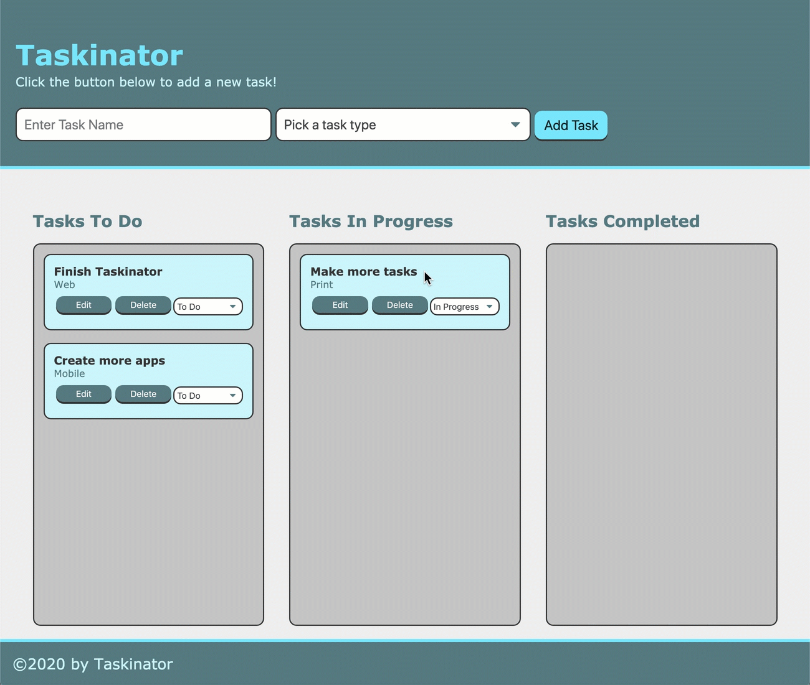

## Taskinator

### Application Deployed To GitHub Pages 

https://priyaravi23.github.io/taskinator/

### Description 

*Build a task-tracker app called Taskinator. Taskinator will allow you to organize your personal to-do list items by clicking and dragging them into categories like To Do, In Progress, and Completed.*

### Mock-up

*The following animation demonstrates the application functionality:*

